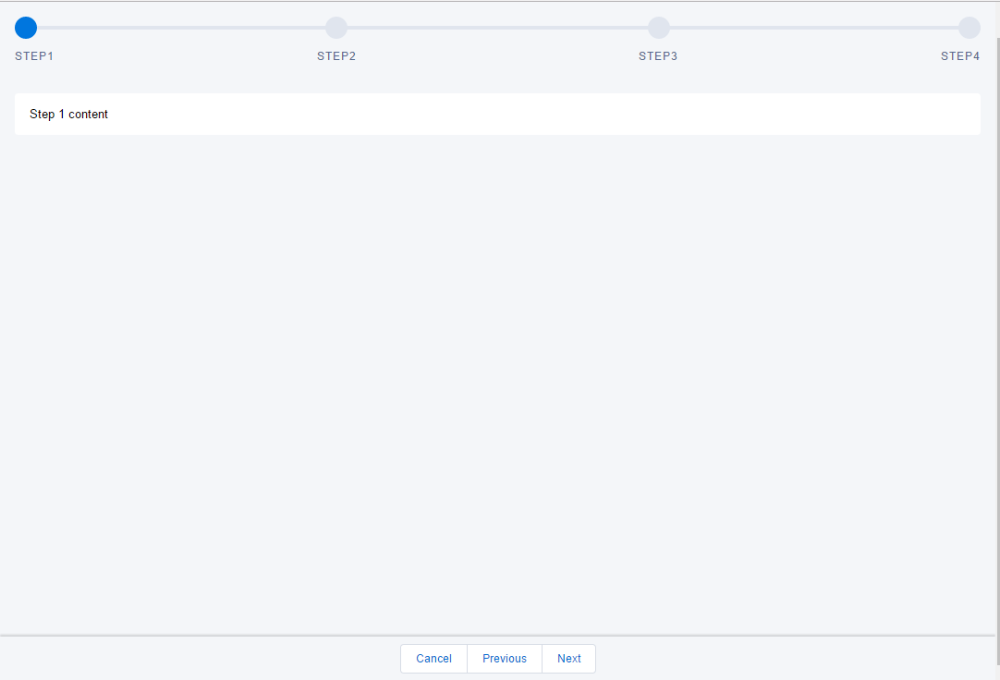

# WizardBaseComponent

A Base lightning component for Wizard using LDS

once you install it into your org. open LightingWizardProcessTestApp in the developer console, and click on preview button to see the component.

Attributes:
   steps -- the string array to define multiple steps

Events:
   newStepEvent -- move the steps in Wizard,
   cancelEvent -- event emitted when wizard being cancelled,
   finishEvent -- event emitted when wizard being finished,

Usage: using four steps as the example( see more in LightingWizardProcessTestApp in the repo)

      <c:LightningWizardProcess aura:id="wizardProcess"
                                  steps="Step1, Step2, Step3, Step4"
                                  newStepEvent="{!c.newStep}"
                                  cancelEvent="{!c.cancel}"
                                  finishEvent="{!c.finish}">
            <!--page1-->
            

                Step 1 content
                <!--replace it with the your page content or another components-->
            

            <!--page2-->
            

                Step 2 content
                <!--replace it with the your page content or another components-->
            

            <!--page3-->
            

                Step 3 content
                <!--replace it with the your page content or another components-->                
            

            <!--page4-->
            

                Step 4 content
                <!--replace it with the your page content or another components-->
            

        </c:LightningWizardProcess>
